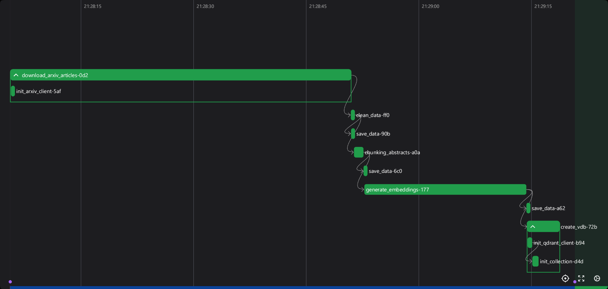
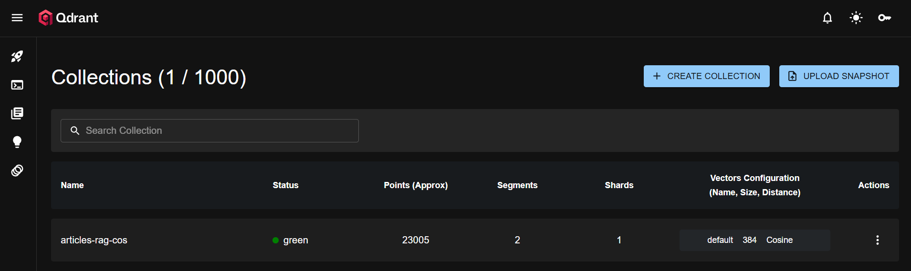
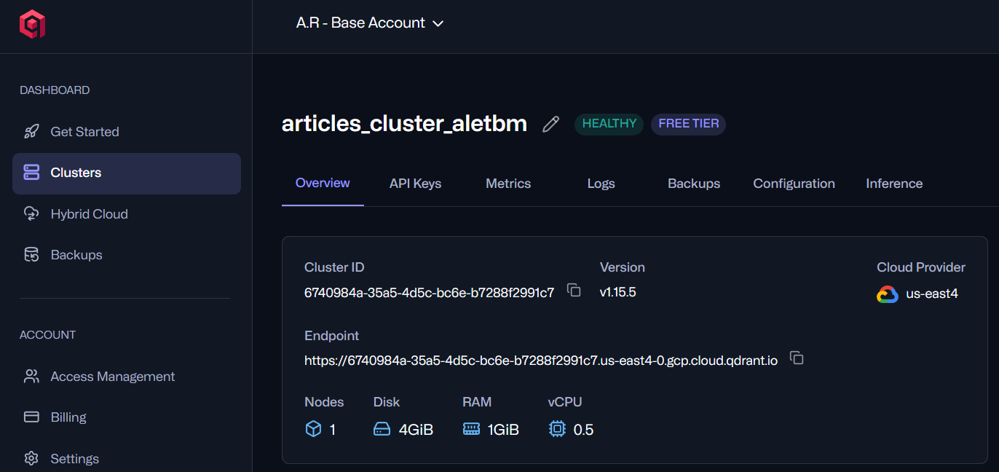
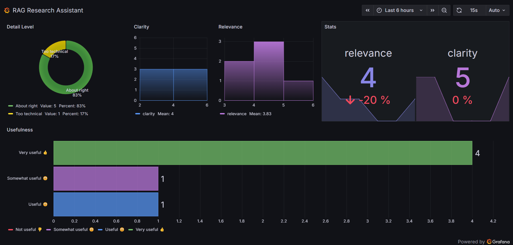

# 📚 RAG Research Assistant


### 🌐 Live Project Links

[](https://research-assist-rag.streamlit.app)
[](https://aletbm.grafana.net/public-dashboards/2e048e03ec0944558e6b73739dcdea37?refresh=auto&from=now-6h&to=now&timezone=browser)
[](https://6740984a-35a5-4d5c-bc6e-b7288f2991c7.us-east4-0.gcp.cloud.qdrant.io:6333/dashboard#/collections)

## Project Description

RAG Research Assistant is an intelligent research assistant designed to help users efficiently explore, retrieve, and summarize academic research. The project addresses a common challenge in academia: the **overwhelming volume of scientific literature** 📈 and the difficulty of quickly finding relevant, high-quality information.

The system leverages a **retrieval-augmented generation (RAG)** workflow by combining the following core technologies:

- **Qdrant Cloud** ☁️ for vector-based semantic storage of academic papers  
- **FastEmbed** ⚡️ for generating high-quality embeddings  
- **Gemini** ✨ as the large language model for summarization and insight generation  

Users interact with the assistant through a **Streamlit** 🖥️ interface, submitting queries and receiving concise, human-readable summaries. This enables faster comprehension and more effective research exploration.

A **feedback loop** 🔄 is implemented using **BigQuery**, where user interactions are recorded, allowing the system to learn and improve over time. The data ingestion, embedding generation, and indexing workflow are orchestrated using **Prefect** ⚙️, ensuring automation, reproducibility, and scalability.

The project also features **Grafana dashboards** 📊 for monitoring performance and user interactions in real-time, providing transparency and operational insight.

In summary, **RAG Research Assistant** simplifies academic discovery by combining vector search, generative AI, and interactive feedback, making it easier for researchers and students to navigate vast collections of literature efficiently. 🚀

---

# Project Structure

```bash
D:.
│   .env                        # Environment variables (API keys, config variables)
│   .gitignore                   # Git ignore rules
│   config.py                    # Project-wide configuration (paths, constants, model names)
│   docker-compose.yml           # Docker Compose configuration for services
│   Dockerfile                   # Dockerfile for building project container
│   LICENSE                      # Project license
│   Makefile                     # Shortcut commands for running pipeline, Streamlit, etc.
│   README.md                    # Project documentation
│   requirements.txt             # Python dependencies
│
├───analysis                     # Jupyter notebooks for analysis and evaluation
│       data_ingestion.ipynb     # Exploratory analysis of ingested data
│       evaluations.ipynb        # Evaluation of RAG system performance
│       vector_databases.ipynb   # Experiments and tests with Qdrant vector DB
│
├───data                         # Main processed data storage
│       articles.parquet
│       articles_chunks.parquet
│       articles_w_embeds.parquet
│       evaluations.csv
│       ground_truth.csv
│       llm_responses.csv
│
├───deployment                   # FastAPI app
│       main.py                  # FastAPI server for RAG API
│       test.py                  # Test scripts for API endpoints
│
├───pipelines                    # Prefect pipelines
│       ingestion_pipeline.py    # Full data ingestion, chunking, embedding, and upload
│       rag_pipeline.py          # RAG query pipeline
│
└───streamlit_app                # Streamlit interface for interacting with RAG system
        app.py                   # Main Streamlit application

```

# Key Analysis and Results

This section details the methodology and critical findings obtained from the analysis (documented in the `data_ingestion.ipynb`, `vector_databases.ipynb`, and `evaluations.ipynb` notebooks) to optimize the performance of the **Retrieval-Augmented Generation (RAG)** system on an arXiv scientific article corpus.

## 1. Vector Database Configuration 💾

**Qdrant** was used as the vector database.

* **Corpus and Chunking:** Data ingestion via the **arXiv API** resulted in a corpus of **121,881 processed text chunks**. The main categories include **cs.LG**, **cs.CV**, **cs.CL**, **cs.AI**, and **stat.ML**.
* **Embedding Model:** The **`BAAI/bge-small-en`** model was used for chunk vectorization.
* **Distance Metrics:** The performance of common Qdrant distance metrics was evaluated: **Cosine Similarity** (`cos`), **Dot Product** (`dot`), **Euclidean** (`euc`), and **Manhattan** (`manh`).

## 2. Retrieval Evaluation

The retrieval stage was evaluated using a **9,880-question** *Ground Truth* dataset generated synthetically with **Ollama**. The key metrics were **Hit Rate** and **Mean Reciprocal Rank (MRR)**.

### Key Retrieval Results 🎯

| Search Scenario | Top-K | Filter | Hit Rate | MRR | Conclusion |
| :--- | :---: | :---: | :---: | :---: | :--- |
| Baseline Search (`Qdrant_20_cos`) | 20 | No | 0.687 | 0.542 | Increasing Top-K from 5 to 20 slightly improved performance. |
| Retrieval with Filter | 20 | Category (cat) | 0.911 | 0.789 | The most significant improvement came from **metadata filtering** (article category), boosting accuracy by 22% (Hit Rate) and 45% (MRR) over the baseline model. |
| Metric (Cos/Dot/Euc + Filter) | 20 | Category (cat) | 0.911 | 0.789 | Cosine, Dot Product, and Euclidean metrics yielded identical and superior results with the filter. |

**Main Retrieval Conclusion:** The most effective strategy for precise retrieval is to combine vector search with filtering by **arXiv categories** as metadata, regardless of whether Cosine Similarity, Dot Product, or Euclidean distance is used.


## 3. Generation Evaluation (LLM) 💡

**Gemini 2.5 Flash Lite** was used for the generation stage. The analysis focused on comparing the quality of the responses (evaluated by **Relevance**, **Faithfulness**, and **Clarity**) under different *prompting* strategies.

### Evaluated Prompting Strategies:

* **`Base`:** A direct prompt requesting a clear, precise explanation with references.
* **`CTS` (Chain-of-Thought Style):** A more structured prompt that requires the model to analyze the context **step by step** (*First, analyze the context step by step... Then, synthesize...*) before generating the final answer, imitating a reasoning process.
* **`FS` (Few-Shot):** A prompt that provides a **complete example** of a question, context, and expected answer to guide the model's format and style.

The goal of this evaluation was to determine which prompting strategy consistently produces higher quality answers, especially in terms of **Faithfulness** to the retrieved context.

---

# Configuration ⚙️

This project uses environment variables to manage sensitive information and API keys. Make sure to create a `.env` file in the project root with the following variables:

```env
# Your email for notifications or app use
EMAIL=your_email@example.com

# API key for Gemini LLM
GEMINI_API_KEY=your_gemini_api_key_here

# API key for Qdrant Cloud (vector database)
QDRANT_CLOUD_API_KEY=your_qdrant_api_key_here
```

These environment variables are loaded automatically by the project to authenticate services like Gemini LLM and Qdrant Cloud.
Do not commit your .env file to version control to keep credentials private.

## Configuration Variables Explained

Here is a detailed explanation of the key configuration variables used in `config.py`:

- **`PATH_ARTICLES = "./data/"`**
  This is the folder where all downloaded and processed article data will be stored. It includes raw articles, chunked abstracts, and embeddings. All parquet files and CSVs are saved here for the pipeline to use.

- **`YEARS = 7`**
  Defines the time range for fetching articles from arXiv. The pipeline will retrieve papers published within the last 7 years.

- **`ARXIV_PAGE_SIZE = 2000`**
  The number of articles the arXiv client fetches per API request. Higher values can speed up data retrieval but may increase memory usage.

- **`ARXIV_MAX_RESULTS = 15000`**
  Maximum number of articles to fetch in total per query. Ensures the pipeline does not try to fetch an excessive number of results that could slow down processing.

- **`LOCAL_DEPLOYMENT = False`**
  Indicates whether the pipeline is running locally (`True`) or using cloud services (`False`). This flag switches URLs and API keys between local containers and cloud endpoints.

- **`GPU = torch.cuda.is_available()`**
  Checks if a CUDA-enabled GPU is available for embedding generation. In this project, the GPU used was an **NVIDIA GeForce GTX 1050 Ti** with **CUDA 12.9**. If `True`, embeddings will be computed on the GPU for faster performance; otherwise, CPU is used.

- **`QDRANT_URL`**
  Sets the Qdrant vector database endpoint depending on the deployment:
  - Cloud: `"https://<your-qdrant-cloud-instance>.us-east4-0.gcp.cloud.qdrant.io:6333"`
  - Local: `"http://qdrant:6333"`
  This allows the same codebase to switch between local and cloud deployments seamlessly.

- **`QDRANT_API_KEY`**
  The API key for Qdrant Cloud, loaded from the `.env` file. If running locally, no API key is required.

- **`os.environ["PREFECT_API_URL"]`**
  Configures the Prefect orchestration server URL based on the deployment environment:
  - Local: `"http://127.0.0.1:4200/api"`
  - Docker/Cloud: `"http://prefect:4200/api"`
  This allows the pipeline to communicate with the Prefect server regardless of where it is deployed.

---

# Makefile Commands

| Command         | Description                                                                                     |
|-----------------|-------------------------------------------------------------------------------------------------|
| `install`       | Installs all Python dependencies listed in `requirements.txt`.                                   |
| `lint`          | Runs `pre-commit` hooks on all files to check code formatting and quality.                      |
| `api-deploy`    | Launches the FastAPI backend locally on `http://0.0.0.0:8080` with hot-reloading enabled.       |
| `build-rag`     | Builds and starts the RAG application using Docker Compose.                                      |
| `test`          | Executes the test script `scripts/test.py` to validate functionality.                            |
| `run-prefect`   | Starts the Prefect server for orchestrating pipelines.                                           |
| `run-qdrant`    | Runs a local Qdrant vector database using Docker, mapping ports `6333` and `6334` and persisting data in `~/qdrant_storage`. |
| `run-streamlit` | Launches the Streamlit web application for interacting with the RAG system.                     |

---

## 📰 Articles Ingestion Pipeline

This pipeline is designed to automatically fetch, clean, process, and store scientific articles from **arXiv** into a **vector database** (Qdrant) for use in a **Retrieval-Augmented Generation (RAG)** system. ⚡️

The pipeline is orchestrated using **Prefect** 🏗️, which allows tasks to run independently, be retried on failure, and track execution.

### 🚀 Pipeline Steps

1. Fetch Articles from arXiv 🔍
2. Clean Data 🧹
3. Text Preprocessing & Chunking ✂️
4. Generate Embeddings 🧠
5. Initialize Qdrant Vector Database 🗄️
6. Save Intermediate Data 💾

### ⚙️ How to Run the Pipeline with Prefect



1. **Install dependencies**

   ```bash
   make install
   ```
2. **Set environment variables** 🌱

   ```bash
   EMAIL=<your-email>
   GEMINI_API_KEY=<your-gemini-key>
   QDRANT_CLOUD_API_KEY=<your-qdrant-key>
   ```

3. **Start Prefect server (optional, for UI and orchestration)**

    ```bash
    make run-prefect
    ```
    + Prefect UI will be available at http://127.0.0.1:4200/ui.
    + You can monitor flows, see logs, and retry failed tasks from the UI.

4. **Run the pipeline locally**

    ```bash
    python pipelines/ingestion_pipeline.py
    ```
    + Prefect will orchestrate the tasks defined with the @task decorator.
    + If a task fails, it will automatically retry based on flow settings

---

## 🗄️ Vector Database (Qdrant)



This project uses **Qdrant** as the vector database to store embeddings of research articles. Qdrant enables efficient similarity search over high-dimensional vectors, which is essential for our Retrieval-Augmented Generation (RAG) system.

### ⚡ Local Usage
For development and analysis, a local instance of Qdrant can be run using Docker:

```bash
docker run -p 6333:6333 -p 6334:6334 -v ~/qdrant_storage:/qdrant/storage qdrant/qdrant
```

+ Port 6333: API endpoint for vector operations.
+ Port 6334: Qdrant gRPC endpoint (optional).
+ Volume ~/qdrant_storage: Persists your vectors locally.

Once running, your pipeline and analysis scripts can connect to this local instance using the URL:

```bash
QDRANT_URL = "http://localhost:6333"
```

### ☁️ Cloud Usage



For the final deployment, Qdrant Cloud is used to host the vector database. This allows the RAG system to scale and be accessible remotely.

This is my endpoint: [Qdrant Cloud Collection](https://6740984a-35a5-4d5c-bc6e-b7288f2991c7.us-east4-0.gcp.cloud.qdrant.io:6333/dashboard#/collections?api_key=eyJhbGciOiJIUzI1NiIsInR5cCI6IkpXVCJ9.eyJhY2Nlc3MiOlt7ImNvbGxlY3Rpb24iOiJhcnRpY2xlcy1yYWctY29zIiwiYWNj)

---

## 🧪 Testing the RAG Pipeline

This section explains how to **test the RAG system** using the `rag_pipeline.py` script. The RAG pipeline retrieves relevant papers from Qdrant and generates concise answers using Gemini LLM.

### 1. Setup Qdrant

Before running the RAG pipeline, you must have a **Qdrant vector database** running:

- **Local Qdrant instance**
    ```bash
    docker run -p 6333:6333 -p 6334:6334 -v ~/qdrant_storage:/qdrant/storage qdrant/qdrant
    ```
- **Qdrant Cloud**: Make sure your API key and collection URL are correctly set in `config.py`:
    ```bash
    QDRANT_URL = "https://<your-qdrant-cloud-instance>.us-east4-0.gcp.cloud.qdrant.io:6333"
    QDRANT_API_KEY = "<your-qdrant-api-key>"
    COLLECTION = "<your-collection-name>"
    ```

### 2. Configure Environment Variables

Set the necessary environment variables in your `.env` file or your shell:
```bash
GEMINI_API_KEY=<your-gemini-key>
QDRANT_CLOUD_API_KEY=<your-qdrant-key>  # Only if using Qdrant Cloud
```

### 3. Running the RAG Pipeline
Edit `rag_pipeline.py` and modify the query and categories variables as needed:
```bash
query = "What is a RAG system?"
categories = ["cs.CL"]  # Optional: Arxiv categories to filter results
```
Run the script:
```bash
python pipelines/rag_pipeline.py
```

Notes
+ Ensure your **Qdrant collection** contains embeddings for the papers you want to query.
+ `categories` is optional; if left empty, results will not be filtered by Arxiv categories.
+ You can adjust `top_k` inside `rag_pipeline.py` to retrieve more or fewer documents.
+ Use this script to experiment with different queries and categories to test your RAG system's performance.

---

### Deploying the Complete RAG System 🚀

To launch the entire RAG system from scratch, including the vector database, ingestion pipeline, and API, run:

```bash
docker compose up --build
```

This does the following:

1. **Builds the containers** (`--build` ensures they are rebuilt if there are changes)
2. **Starts Qdrant**, the vector database that stores document embeddings
3. **Runs Prefect**, which orchestrates the ingestion and processing pipelines
4. **Executes** `ingestion_pipeline.py`, which ingests documents, converts them to embeddings, and stores them in Qdrant
5. **Launches the FastAPI app**, providing an API to query the RAG system and get answers from the ingested documents

✅ This makes the full RAG system fully operational and ready to answer questions from scratch

---

### Streamlit App 🌐

https://github.com/user-attachments/assets/9ba32654-301e-43ef-9ee3-25f0db131a6d

The **RAG Research Assistant** Streamlit app provides an interactive interface to explore and interact with academic papers using a Retrieval-Augmented Generation (RAG) system powered by **Qdrant** and **Gemini**.

**Features:**

- **Ask questions** ❓: Enter any research question and get synthesized answers from retrieved papers.
- **Category filtering** 🔍: Optionally filter results by Arxiv categories such as Machine Learning, Computer Vision, AI, etc.
- **View retrieved papers** 📚: See the title, authors, publication date, URL, and abstract of each retrieved paper.
- **Embedded PDF viewer** 📄: Open and view the full PDF of each paper directly in the app.
- **AI-generated answers** 🧠: Gemini generates clear, concise answers based solely on the context from the retrieved papers.
- **Feedback form** 💬: Rate usefulness, relevance, clarity, and detail level of answers, and leave comments. Feedback is stored in BigQuery for later analysis.

**How to run the app locally:**

```bash
streamlit run streamlit_app/app.py
```

Or **access it online**: 🌐 [RAG Research Assistant on Streamlit Cloud](https://research-assist-rag.streamlit.app)

This provides a user-friendly interface to explore research papers without coding, making it ideal for testing, demonstrations, or daily research assistance.

---

### Grafana Dashboard 📊



User feedback collected through the Streamlit app is automatically stored in **Google BigQuery** and visualized in **Grafana** to monitor the performance and quality of the RAG system.

**Dashboard features:**
- **Usefulness & Relevance** ⭐: Track how helpful and relevant users find the generated answers.
- **Clarity & Detail Level** 🧠: Visualize how clear and technically appropriate the responses are.
- **Trends over time** ⏱️: Monitor changes in feedback metrics as the model or data evolve.
- **Interactive charts** 📈: Filter and analyze feedback based on categories, time ranges, or question types.

You can explore the live public dashboard here: 👉 [View RAG Feedback Dashboard on Grafana](https://aletbm.grafana.net/public-dashboards/2e048e03ec0944558e6b73739dcdea37?refresh=auto&from=now-6h&to=now&timezone=browser)

This setup provides real-time insights into user feedback and helps continuously improve the RAG system’s accuracy and usability.
